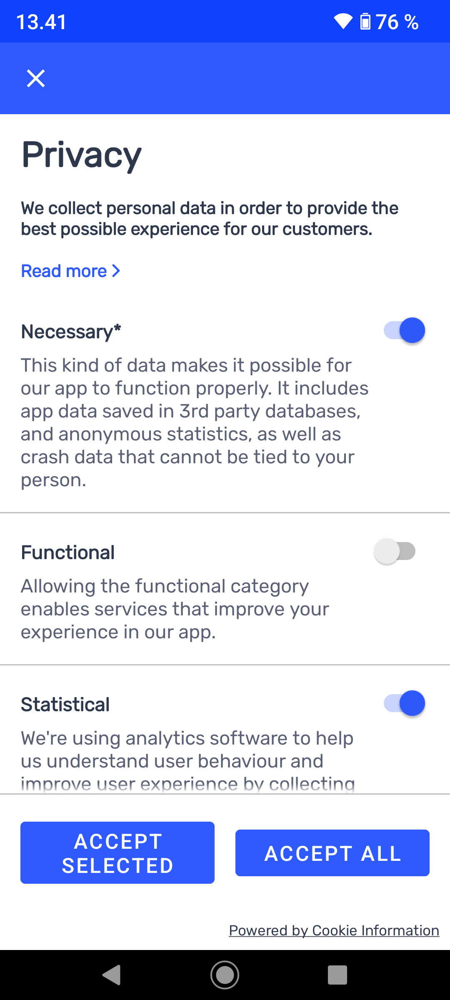

[](https://search.maven.org/artifact/com.cookieinformation/mobileconsents)
# Mobile Consents
### Android SDK for easy user consent management.

## Integration  
To add SDK to your app add dependency in `build.gradle(.kts)` file:

Groovy DSL
```groovy
implementation "com.cookieinformation:mobileconsents:<latest_release>"
```  

Kotlin DSL
```kotlin
implementation("com.cookieinformation:mobileconsents:<latest_release>")
```

#### Concept
The `MobileConsentSdk` is designed to use it with Kotlin and Coroutines. For those who doesn't use Coroutines we provide wrapper `CallbackMobileConsentSdk` that uses callbacks.

#### Error Handling
All exceptions thrown by SDK are wrapped by an `IOException` and thrown by SDK methods or passed to the `onFailure` method of a `CallListener` callback in case of using `CallbackMobileConsentSdk`.
  
#### Async operations
All SDK's public methods are executed asynchronously using Coroutines on a IO thread pool. If you do not want to use Coroutines, you may use `CallbackMobileConsentSdk` where you should rely on callbacks (`CallListener`) to handle
operation results. The callbacks, by default, are executed on **Main Thread**.  
You can easily wrap those callbacks with LiveData / RxJava etc, if you use any of them. Every method of the callback version of the SDK returns a `Subscription`
object, which you can use to cancel the ongoing request (see the `Async operation cancelling` section).
  
#### Dependencies: 
SDK exposes [OkHttp](https://square.github.io/okhttp/) in its API. 
  
### Using the SDK:

#### Setup

Join our partner program for free at [Cookie Information](https://cookieinformation.com/)

Add the below credentials in your app projects `local.properties` file in Android Studio after joining

#### Credentials
```
CLIENT_ID = "xxx"
CLIENT_SECRET= "xxx"
SOLUTION_ID = "xxx"
```

#### Initializing

To instantiate SDK use `Builder` static method of `MobileConsentSdk` class:

#### Java:
```java
CallbackMobileConsentSdk sdk = CallbackMobileConsentSdk.from(
  MobileConsentSdk.Builder(context)
      .callFactory(new OkHttpClient())
      .build()
);
```

#### Kotlin:
```kotlin
val sdk = CallbackMobileConsentSdk.from(
  MobileConsentSdk.Builder(context)
    .callFactory(OkHttpClient())
    .build()
    )
```
Note that you have to pass `Context` of your Application/Activity to the builder. `callFactory` method is optional - if OkHttp's [Call.Factory](https://square.github.io/okhttp/4.x/okhttp/okhttp3/-call/-factory/) isn't provided, SDK will instantiate it's own.

#### Getting consent solution

To fetch `ConsentSolution` from server, use `fetchConsentSolution` method:

ConsentSolution object structure:
```kotlin
// ConsentSolution object structure
public data class ConsentSolution(
  val consentItems: List<ConsentItem>,
  val consentSolutionId: UUID,
  val consentSolutionVersionId: UUID,
  val uiTexts: UiTexts
)

public data class ConsentItem(
  val consentItemId: UUID,
  val shortText: List<TextTranslation>,
  val longText: List<TextTranslation>,
  val required: Boolean,
  val type: Type, // Setting, Info
)

public data class TextTranslation(
  val languageCode: String,
  val text: String
)

```

#### Java:
```java
sdk.fetchConsentSolution(
  new CallListener<ConsentSolution>() {
    @Override public void onSuccess(ConsentSolution result) {
      // do something with result
    }

    @Override public void onFailure(@NotNull IOException error) {
      // do something with error
    }
  }
);
```

#### Kotlin:
```kotlin
 yourCoroutineScope.launch {
  try {
    val consentSolution = sdk.fetchConsentSolution()
    // do something with result
  } catch (e: IOException) {
    // do something with error
  }
}
```
After downloading a solution, you can show all consent items to the user and obtain their choices.

#### Sending consent to a server

SDK requires you to gather all consent choices in one `Consent` object. : 
```kotlin
public data class Consent(
  val consentSolutionId: UUID,
  val consentSolutionVersionId: UUID,
  val processingPurposes: List<ProcessingPurpose>,
  val customData: Map<String, String>,
)
```

Inside, you can pass a list of `ProcessingPurpose` - user consents:
```kotlin
public data class ProcessingPurpose(
  val consentItemId: UUID,
  val consentGiven: Boolean,
  val language: String
)
```

A `Consent` object can also store any additional info you want - in a form of a `Map<String, String>` map as a `customData` field.

To post `Consent` to a server, use `postConsent` method:

#### Java:
```java
sdk.postConsent(
  consent, // Consent object
  new CallListener<Unit>() {
    @Override public void onSuccess(Unit result) {
      // consent sent successfully
    }

    @Override public void onFailure(@NotNull IOException error) {
      // do something with error
    }
  }
); 
```

#### Kotlin:
```kotlin
yourCoroutineScope.launch {
  try {
    postConsent(
      consent = consent, // Consent object
    )
    // consent sent successfully
  } catch (e: IOException) {
    // do something with error
  }
}
```
Once a request is successful, all consent choices are stored in SDK's internal storage, as a map of consent item IDs and booleans representing user choices.

#### Getting locally saved consent data

To read consent choices from SDK, use following methods:

To retrieve all consent choices, saved on device memory, use `getConsentChoices` method:
#### Java:
```java
sdk.getSavedConsents(
  new CallListener<Map<UUID, Boolean>>() {
    @Override public void onSuccess(@NotNull Map<UUID, Boolean> result) {
      // do something with result
    }

    @Override public void onFailure(@NotNull IOException error) {
      // do something with error
    }
  }
 );
```

#### Kotlin:
```kotlin
yourCoroutineScope.launch {
  try {
    val result = getSavedConsents()
    // do something with result
  } catch (e: IOException) {
    // do something with error
  }
}
```
  
To retrieve specific consent choice, use `getConsentChoice` method and pass id of `ConsentItem`:
#### Java:
```java
sdk.getSavedConsent(
  consentItemId, // UUID of consent item 
  new CallListener<Boolean>() {
    @Override public void onSuccess(@NotNull Boolean result) {
      // do something with result
    }

    @Override public void onFailure(@NotNull IOException error) {
      // do something with error
    }
  }
 );    
```

#### Kotlin:
```kotlin
yourCoroutineScope.launch {
  try {
    val result = getSavedConsent(
      consentItemId = consentItemId, // UUID of consent item 
    )
    // do something with result
  } catch (e: IOException) {
    // do something with error
  }
}
```

#### Async operation cancelling

Use `Subscription` object returned from every SDKs method.
#### Java:
```java
Subscription subscription = sdk.getConsentChoice(
  consentItemId, // UUID of consent item 
  new CallListener<Boolean>() {
    @Override public void onSuccess(@NotNull Boolean result) {
      // do something with result
    }

    @Override public void onFailure(@NotNull IOException error) {
      // do something with error
    }
  }
 );   

subscription.cancel(); 
```

#### Kotlin:
```kotlin
// Note that, all jobs are canceled when you CoroutineScope is canceled.
// However you can cancel the job manually.
val job = youCoroutineScope.launch {
  sdk.getConsentChoices(
    consentItemId = consentItemId // UUID of consent item 
  )
}
job.cancel()
```

#### UI template texts
The response from the server `ConsentSolution` also includes suggested texts to be used in the user interface.
There are two screens considered:
 - **PrivacyPreferences**: The screen where the user accepts consents when using the application for the first time or registering an account.
 - **PrivacyCenter**: The screen where the user can change his consents, usually displayed in the application preferences.

```kotlin
public data class UiTexts(
  val privacyPreferencesTitle: List<TextTranslation>,
  val privacyPreferencesDescription: List<TextTranslation>,
  val privacyPreferencesTabLabel: List<TextTranslation>,

  val privacyCenterButton: List<TextTranslation>,
  val acceptAllButton: List<TextTranslation>,
  val rejectAllButton: List<TextTranslation>,
  val acceptSelectedButton: List<TextTranslation>,
  val savePreferencesButton: List<TextTranslation>,

  val privacyCenterTitle: List<TextTranslation>,

  val poweredByLabel: List<TextTranslation>,
  val consentPreferencesLabel: List<TextTranslation>
)
```

##### Text translations
There is static helper method `TextTranslation.getTranslationFor(...)` which returns the best matching translation for given locales list.

#### Predefined plug&play UI component
There is a predefined, easy to integrate, user interface component:

- `BasePrivacyFragment`: this view allows the user to read information about the consents and accept selected consents.




##### Integration of the `BasePrivacyFragment`
The integration is very easy. The fragment that extends `BasePrivacyFragment` should be created and all abstract methods
should be implemented. Then the fragment can be used as any other fragment (with navigation component, in XML layout, etc..).

#### Java:
```java
public class PrivacyFragment extends BasePrivacyFragment {

  @NotNull
  @Override
  protected ConsentSolutionBinder bindConsentSolution(@NotNull ConsentSolutionBinder.Builder builder) {
    // This method binds the SDK instance
    MobileConsentSdk mobileConsentSdk = ... // your SDK instance (keep in mind that the same instance should be used after configuration has changed)
    return builder
        .setMobileConsentSdk(mobileConsentSdk)
        .create();
  }

  @Override
  public void onConsentsChosen(
      @NotNull ConsentSolution consentSolution,
      @NotNull Map<UUID, Boolean> consents,
      boolean external
  ) {
    // Handle given consents, you may skip this step if the consents has been saved externally.
    // Navigate back
  }

  @Override
  public void onDismissed() {
    // Navigate back
  }
}
```

#### Kotlin:
```kotlin
class PrivacyFragment : BasePrivacyFragment() {

  override fun bindConsentSolution(builder: ConsentSolutionBinder.Builder): ConsentSolutionBinder {
    // This method binds the SDK instance
    val mobileConsentSdk = ... // your SDK instance (keep in mind that the same instance should be used after configuration has changed)
    return builder
      .setMobileConsentSdk(mobileConsentSdk)
      .create()
  }

  override fun onConsentsChosen(consentSolution: ConsentSolution, consents: Map<UUID, Boolean>, external: Boolean) {
    // Handle given consents, you may skip this step if the consents has been saved externally.
    // Navigate back
  }

  override fun onDismissed() {
    // Navigate back
  }
}
```

##### Styling UI components
The UI elements inherits the style from the application theme, however there is possibility to change appearance of predefined views.

The text colors are imported from attributes `android:textColorPrimary` and`android:textColorSecondary`.
The first one is used for emphasised texts like title or links, the second one is used as default text color.

The buttons styles uses the application theme. It has custom style based on color `colorAccent`.

Generally it is possible to override style of almost all widgets. If it is necessary, the developer
must find the corresponding style and override it in their own application.
Here are few examples:

- Changing the font: the developer needs to override `MobileConsents_BaseTextAppearance` style.
```
<style name="MobileConsents_BaseTextAppearance">
  <item name="android:fontFamily">sans-serif-condensed</item>
</style>
```

- Changing default text size: the developer needs to override `mobileconsents_text_size` dimension.
- Changing default preference item text size: the developer needs to override `mobileconsents_preference_item_text_size` dimension.
- Changing default privacy title text size: the developer needs to override `mobileconsents_privacy_title_text_size` dimension.
